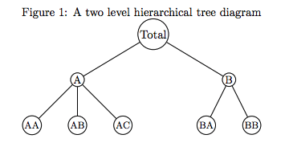
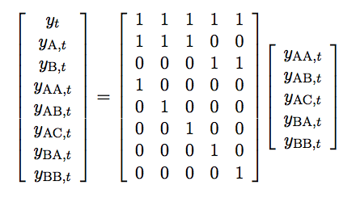

layout: true
background-color: #fafaef
<div class="my-footer"></div>

```{r setup, include=FALSE}
options(htmltools.dir.version = FALSE)
knitr::opts_chunk$set(echo = TRUE)

library(tidyverse)
library(forecast)
library(tsibble)
```

---

## Hierarchical Time Series

- In many applications time series can be organized in a hierarchical structure
  - e.g. by geography, product types, market segments
    - data that can be _disaggregated_ 

- It is common to produce disaggregated forecasts based on the bottom-level time series, but what if we wanted to also forecast the intermediate and top-level series?
  - We would expect the forecasts to be _coherent_
    - add up in a manner that is consistent with the hierarchical structure

---

## Hierarchical Time Series



- AA + AB + AC = A

- A + B = Total

---

## Hierarchical Time Series

For any time _t_, the observations of the bottom-level series will aggregate to the observations of the series above.

- *S* matrix



- dictates how the bottom level series are aggregated, consistent with the hierarchical structure

---

## Methods

- Bottom-up
- Top-down
- Middle-out
- Optimal Combination

---

## US National Parks Visitor Data

- From: https://data.world/inform8n/us-national-parks-visitation-1904-2016-with-boundaries
  - scraped from source [here](https://irma.nps.gov/Stats/SSRSReports/National%20Reports/Annual%20Summary%20Report%20(1904%20-%20Last%20Calendar%20Year)

```{r, message=FALSE}

nps <- read_csv("../data/All National Parks Visitation 1904-2016.csv") %>% 
  janitor::clean_names() %>% 
  select(park_name = unit_name,
         park_code = unit_code,
         park_type = unit_type,
         state,
         region,
         year      = year_raw,
         visitors) %>% 
  arrange(year) %>% 
  filter(year != "Total") %>% 
  mutate(year = as.numeric(year)) %>% 
  filter(park_type == "National Park") %>% 
  filter(park_name != "Denali National Preserve") # duplicate
```

---

```{r, fig.width=10, fig.height = 6}

# by park
nps %>% 
  ggplot(aes(x = year, y = visitors, colour = park_code)) +
  geom_line() + theme(legend.position = "bottom") + 
  guides(colour=guide_legend(ncol=11))
```

---

```{r, fig.width = 10, fig.height = 5.5}

# by state
nps %>% 
  group_by(state, year) %>% 
  summarise(visitors = sum(visitors)) %>% 
  ggplot(aes(x = year, y = visitors, colour = state)) +
  geom_line() + theme(legend.position = "bottom") +
  guides(colour=guide_legend(ncol = 11))
```

---

```{r, fig.width = 10, fig.height = 5.5}
# by region
nps %>% 
  group_by(region, year) %>% 
  summarise(visitors = sum(visitors)) %>% 
  ggplot(aes(x = year, y = visitors, colour = region)) +
  geom_line() + theme(legend.position = "bottom")+
  guides(colour=guide_legend(ncol = 7))
```

---

## Bottom-up method

- Forecast bottom-level series, then use aggregation (simple addition) to obtain forecasts at higher levels

- Advantage: no information is lost due to aggregation
- Disadvantage: bottom-level data can be noisy and more challenging to forecast

- `method = "bu"`

---

## Top-down method

- Forecast the "total" aggregated series, then disaggregate the forecasts

- Advantage: when bottom-level data are noisy, top-down method produces more accurate forecasts
    - useful with low count data
- Disadvantage: loss of information due to aggregation
    - unable to capture individual series characteristics (e.g. special events)
    - tend to produce less accurate forecasts at lower levels of the hierarchy than bottom-up

- Several methods (20+) have been developed to disaggregate
    - average historical proportions
    - proportions of the historical averages
    - forecasted proportions

---

## Average historical proportions

- Each proportion, $p_{j}$ reflects the average of the historical proportions of the bottom-level series $y_{j,t}$ over the period _t_ = 1,..., _T_ relative to the total aggregate $y_{t}$

$$p_{j} = \frac{1}{T}\sum_{t=1}^{T}{\frac{y_{j,t}}{y_{t}}}$$

- Introduced in Gross & Sohl (1990)
    - `method = "tdgsa"` for "top-down Gross-Sohl method A"
  
---

## Proportions of the historical averages
        
- Each proportion $p_{j}$ captures the average historical value of the bottom-level series $y{j,t}$ relative to the average value of the total aggregate $y_{t}$

$$p_{j} = \sum_{t=1}^{T}{\frac{y_{j,t}}{T}} / \sum_{t=1}^{T}{\frac{y_{t}}{T}}$$

- Introduced in Gross & Sohl (1990)
    - `method = "tdgsf"` for "top-down Gross-Sohl method F"

---

## Forecasted proportions

- Developed by Athanasopoulos et al (2009)

1. first generate _h_-step-ahead base forecasts for all the series independently
2. starting from the top level, we calculate the proportion of each _h_-step-ahead base forecast to the aggregate of all the _h_-step-ahead base forecasts at that level
    - these are the _forecasted proportions_, which are used to disaggregate and generate revised forecasts
3. for a _K_-level hierarchy, step 2 is repeated for each node going from top to bottom

- `method = "tdfp"`

---

## Middle-out method

- Combines bottom-up and top-down approaches
    1. "middle level" is chosen and base forecasts are generated for all the series of this level and below
    2. for series above the middle level, forecasts are generated using bottom up approach by aggregating the middle level base forecasts upwards
    3. for series below the middle level, revised forecasts are generated using a top-down approach (`method = "tdfp"` in `hts`)

- `method = "mo"`

---
  
## Optimal Combination

- Proposed by Hyndman, et al (2011) and further explored in Wickramasuriya et al (2018)

- advantages:
    - uses _all_ information available within the hierarchy
    - allows for correlations and interactions between series at each level of the hierarchy
    - produces unbiased revised forecasts if base forecasts are unbiased
      
---

## Optimal Combination

- General idea: represent the _h_-step-ahead base forecasts for the entire hierarchy by a linear regression model

$$\hat{y_h} = S\beta_h + \epsilon_h$$

- $\hat{y_h}$ is a vector of the _h_-step-ahead base forecasts for the entire hierarchy
- $S$ is the S (summing) matrix
- $\beta_h$ is the unknown mean of the future values of the bottom level _K_
- $\epsilon_h$ is the error in the regression and has zero mean and unknown covariance matrix $\Sigma_h$

---

## Optimal Combination

- General idea: represent the _h_-step-ahead base forecasts for the entire hierarchy by a linear regression model

$$\hat{y_h} = S\beta_h + \epsilon_h$$

- If the base forecasts satisfy the hierarchical aggregation structure, then the errors should also satisfy the hierarchical aggregation structure, or $\epsilon_h \approx S\epsilon_{K,h}$, where \epsilon_{K,h} contains the forecast errors in the bottom level.
    - Under this assumption, Hyndman et al (2011) show that the best linear unbiased estimator for $\beta_h$ is
    
    $$\hat{\beta_h} = S(S^\prime S)^{-1}S^\prime\hat{y_h}$$
  - note, the estimator does not depend on the unknown covariance matrix $\Sigma_h$
 
---

Let's try to forecast the number of visitors to the national parks. First convert the data to an `hts` object and split into train/test sets.

```{r}

library(hts)

nps_ts <- nps %>%
  arrange(region, state) %>% 
  mutate(park_code = paste0(region, state, park_code)) %>% 
  select(park_code, year, visitors) %>%
  spread(park_code, visitors) %>% 
  as_tsibble(index = "year") %>% 
  as.ts()

nps_hts <- hts(nps_ts,
               characters = c(2, 2, 4))

names(nps_hts$labels) <- c("Total", "Region", "State", "Park")

train <- window(nps_hts, start = 1904, end = 2004)
test  <- window(nps_hts, start = 2005)
```

---

```{r}

nps_fcasts <- forecast(
  train,
  h = 12,                 # forecast next 12 years (2005-2016)
  method = "comb",        # optimal combination
  fmethod = "ets",        # exponential smoothing
  keep.fitted = TRUE,
  keep.resid = TRUE
)

nps_fcasts
```

---

```{r, fig.width = 10}
plot(nps_fcasts, levels = c(0, 1))
```

---

```{r, fig.width = 10}
plot(nps_fcasts, levels = c(2, 3))
```

---

How'd the optimal combination forecast perform on parks in the northeast region?

```{r}

# calculate performance on test set
metrics <- nps_fcasts %>% 
  accuracy.gts(test) %>% 
  broom::tidy() %>% 
  rename(metric = .rownames) %>% 
  as_tibble() %>% 
  mutate_if(is.numeric, round, 2)

metrics %>% 
  mutate(method = "comb") %>% 
  select(method, metric, Total, contains("NE")) %>% 
  filter(metric == "MAPE") %>% 
  knitr::kable("html")
```

---

Which method produces the most accurate forecasts for the NPS visitor data on the northeast region?

```{r, results = "hide", warning = FALSE, echo = FALSE}

hts_fcast_metrics <- function(train, test, h, method, fmethod, region) {
  
  nps_fcasts <- forecast(
    train,
    h = h,
    method = method,        
    fmethod = fmethod,     
    keep.fitted = TRUE,
    keep.resid = TRUE,
    level = 2
  )

  # calculate performance on test set
  metrics <- nps_fcasts %>% 
    accuracy.gts(test) %>% 
    broom::tidy() %>% 
    rename(metric = .rownames) %>% 
    as_tibble() %>% 
    mutate_if(is.numeric, round, 2) %>% 
    mutate(method = method) %>% 
    select(method, metric, Total, everything())

  metrics
} 
```

```{r, warning = FALSE}

hts_methods  <- c("bu",    "tdgsa", "tdgsf", "tdfp",  "comb", "mo")
hts_fmethods <- c("arima", "ets",   "ets",   "ets",   "ets",  "ets")

tbl <- map2_df(
  hts_methods, hts_fmethods, ~ hts_fcast_metrics(train, test, 12, .x, .y)
)

tbl %>%
  filter(metric == "MAPE") %>%
  select(method, metric, Total, AK, IM, MW, NC, NE, PW, SE) %>% 
  arrange(NE) %>% knitr::kable("html")
```

---

```{r}
tbl %>%
  filter(metric == "MAPE") %>%
  select(method, metric, Total, contains("NE")) %>% 
  arrange(NE) %>%
  knitr::kable("html")
```

---

## Conclusions

- Optimal combination approach forecast performed the best on the NE region.

- For regions with large variability in park-level time series, top-down approaches performed better
    - MW, NC
    
- AK did not have noisy park-level data, so bottom-up method performed well

---

## Other Points

- "bottom up" and "optimal combination" methods can also be used for "grouped" time series
    - e.g. first disaggregated by geography, then by gender
    - `gts()` function

- Prediction intervals are not yet implemented directly in `hts`

---

## References

- Hyndman's Forecasting Principles and Practice [book](https://otexts.org/fpp2/hierarchical.html)

- `hts` [vignette](https://cran.r-project.org/web/packages/hts/vignettes/hts.pdf)

- Hyndman et al (2011) optimal combination [paper](https://robjhyndman.com/papers/Hierarchical6.pdf)


